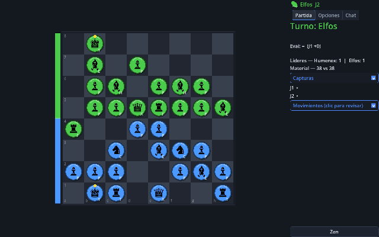
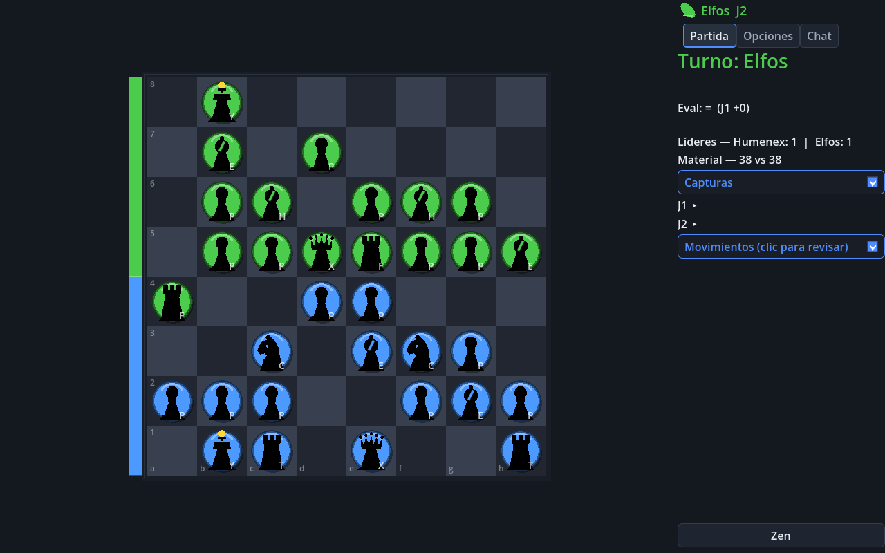
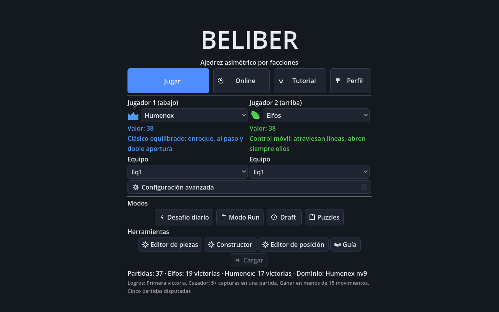
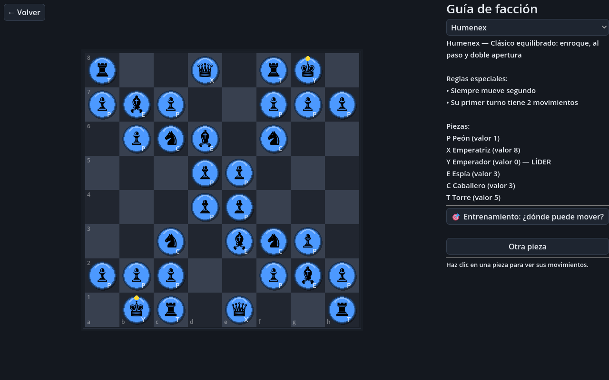
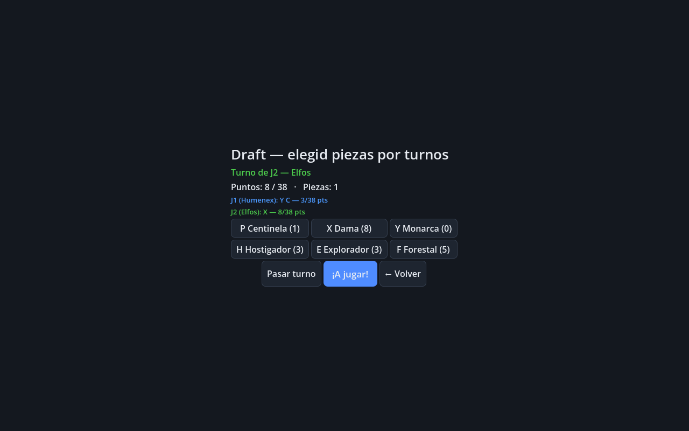
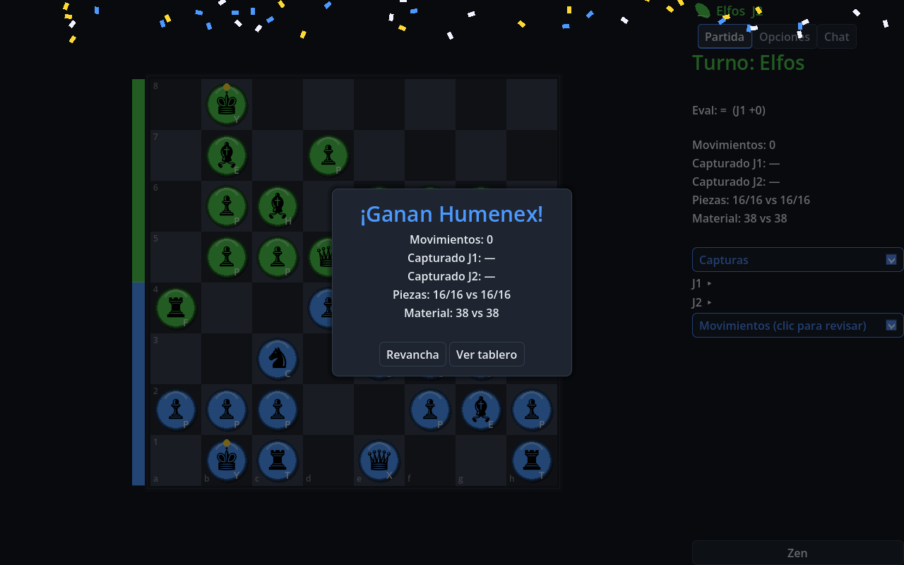

# Beliber

**Juego de estrategia por turnos asimétrico** — 7 facciones con piezas,
efectos y reglas de victoria propias (empujar, atraer, atravesar,
inmovilizar, salto de Aquonte, doble apertura Humenex, Consorte que copia
la gama de lo capturado). Motor completo en **Godot 4**, con editores
reprogramables, IA con niveles y estilos, y juego en red con ladder ELO.

[](LICENSE)


[](https://github.com/alesanfe/beliber/actions/workflows/ci.yml)





<details>
<summary>Más capturas — menú, guía de facción, draft y post-partida</summary>

| Menú | Guía de facción |
|---|---|
|  |  |

| Draft | Resumen post-partida |
|---|---|
|  |  |

</details>

[Reglas](COMO_FUNCIONA.md) ·
[Arquitectura](docs/ARCHITECTURE.md) ·
[Contribuir](CONTRIBUTING.md) ·
[Seguridad](SECURITY.md) ·
[Changelog](CHANGELOG.md) ·
[Soporte](SUPPORT.md)

## Contenido

- [Estado](#estado) · [Características](#características) ·
  [Qué incluye / qué no](#qué-incluye--qué-no)
- [Inicio rápido](#inicio-rápido) · [Tests](#tests) ·
  [Estructura](#estructura) · [Host](#operar-el-host-autoritativo-opcional)
- [Solución de problemas](#solución-de-problemas) ·
  [Hoja de ruta](#hoja-de-ruta) ·
  [Limitaciones](#limitaciones-conocidas)
- [Documentación](#documentación) · [Contribuir](#contribuir) ·
  [Licencia](#licencia)

## Estado

> [!NOTE]
> **Beta funcional** (v0.1.x). Motor completo y cubierto por tests;
> interfaz pulida con análisis, replay, hints y post-partida. Arte
> temporal (glifos de ajedrez + colores de facción); los sprites
> definitivos están pendientes. El formato BEL-FEN y los datos de
> facciones pueden cambiar antes de 1.0.

## Características

- **7 facciones asimétricas** con mecánicas distintivas: enroque y doble
  apertura (Humenex), atravesar e inmovilizar (Elfos), Consorte que copia
  patrones (Mortifers), empuje (Enanos/Kronturs), ataque a distancia
  (Chlontos), cadena del Tritón (Aquontes), saltadores (Bestiarios).
- **Modos**: local hotseat, vs IA (3 niveles × 4 estilos), IA-vs-IA,
  desafío diario determinista, modo Run roguelike con bendiciones,
  draft con presupuesto (estilo CEO), puzzles con Rush.
- **Editores**: piezas (patrón por casillas), ejército personalizado y
  posición (BEL-FEN). Reglas y ejércitos reprogramables.
- **Online**: ENet directo, relay WebSocket, o host autoritativo con
  matchmaking, salas por código, reconexión, chat y ladder ELO.
- **Partida seria**: reloj Fischer, undo local, replay interactivo,
  exportación de log y PNG, hints, mapa de influencia, anti-estancamiento.
- **Progresión**: logros, XP, estadísticas, récords por facción.
- **i18n**: interfaz traducible (es/en) vía Godot `TranslationServer`.

## Qué incluye / qué no

| Incluye | No incluye |
|---|---|
| Motor completo y reglas fieles a las hojas de diseño | Arte final y animaciones |
| Juego local, IA y online funcional | Matchmaking público con cuentas |
| Editores de piezas/ejército/posición | Despliegue a stores |
| Host autoritativo autoalojable | Sonido completo (beeps de sintetizador) |

## Inicio rápido

Requisito: **Godot 4.7+** (probado con 4.7.2 stable).

```bash
git clone https://github.com/alesanfe/beliber.git
cd beliber
godot --path game
```

Se abre el menú principal. Pulsa **Jugar** para una partida local.

## Tests

Un comando lo verifica todo:

```bash
powershell tools/test_all.ps1    # o tools/test_all.sh en POSIX
                                 # (env GODOT=<binario> si no está en PATH)
```

Suites individuales:

```bash
godot --headless --path game -s res://tests/run_tests.gd     # motor + regresiones
godot --headless --path game -s res://tests/playthrough.gd   # partidas bot-vs-bot
godot --headless --path game -s res://tests/_smoke.gd        # smoke de UI
godot --headless --path game -s res://tests/e2e.gd           # partida por clicks
```

Red (`pip install -r server/requirements.txt` primero; servidores
levantados):

```bash
python server/relay.py                                        # relay :7778
godot --headless --path game -s res://server/host.gd -- 7779  # host autoritativo
python server/test_relay.py && python server/test_host.py \
    && python server/test_ladder.py
godot --headless --path game -s res://tests/e2e_net.gd        # 2 clientes x relay
```

Para aislar datos de tests: `BELIBER_CFG`, `BELIBER_SAVE`,
`BELIBER_EXPORT`, `BELIBER_RATINGS`, `BELIBER_TOKENS`
(ver `game/README.md`).

## Estructura

```
beliber/
├── game/             # proyecto Godot (src/, scenes/, tests/, i18n/)
│   └── server/       # host.gd autoritativo (WebSocket)
├── server/           # relay.py + PROTOCOL.md + tests Python
├── tools/            # test_all, release, utilidades
├── docs/             # arquitectura, requisitos, decisiones, ops
├── COMO_FUNCIONA.md  # reglas completas (leyenda + facciones)
└── game/README.md    # guía técnica (arquitectura, tests, red)
```

## Operar el host autoritativo (opcional)

```bash
godot --headless --path game -s res://server/host.gd -- 7779
```

- **Health check:** WS `{"op":"ping"}` →
  `{"op":"pong","queue":M,"rooms":N,"v":"X.Y.Z"}` + heartbeat/minuto:
  `stats rooms=N peers=N pending=N queue=N msgs/min=N`.
- **TLS:** `BELIBER_TLS_CERT` + `BELIBER_TLS_KEY` (PEM) sirve `wss://`.
  `BELIBER_TLS_INSECURE=1` omite validación para autofirmados.
- **Persistencia:** `beliber_ratings.json` + `beliber_idtokens.json`
  en `user://`, escritura atómica con `.bak`. Backup = copiar esos
  archivos; restaurar = devolverlos.
- **Rollback:** `git checkout vX.Y.Z` (tags SemVer).
- **Límites:** `MAX_ROOMS` 500, 512 conexiones, 5 s handshake,
  32 paquetes/iter, 64 KB/mensaje, chat 200 chars, salas TTL 4 h,
  partidas <4 plies no cuentan ELO.

## Documentación

| Tipo | Documento |
|---|---|
| Reglas | [COMO_FUNCIONA.md](COMO_FUNCIONA.md) |
| Arquitectura | [docs/ARCHITECTURE.md](docs/ARCHITECTURE.md) |
| Guía técnica | [game/README.md](game/README.md) |
| Protocolo red | [server/PROTOCOL.md](server/PROTOCOL.md) |
| Requisitos | [docs/REQUIREMENTS.md](docs/REQUIREMENTS.md) |
| Modelo de amenazas | [docs/THREAT_MODEL.md](docs/THREAT_MODEL.md) |
| Privacidad | [docs/PRIVACY.md](docs/PRIVACY.md) |
| Madurez | [docs/MATURITY.md](docs/MATURITY.md) |
| Deuda técnica | [docs/TECH_DEBT.md](docs/TECH_DEBT.md) |
| ADRs | [docs/decisions/](docs/decisions/) |
| Operación | [docs/operations/](docs/operations/) |

## Solución de problemas

**`godot` no se reconoce** — usa la ruta completa del binario o define
`GODOT=<ruta>` al lanzar `tools/test_all`.

**El host WebSocket no acepta conexiones `wss://`** — sin
`BELIBER_TLS_CERT`/`BELIBER_TLS_KEY` el host solo sirve `ws://`
(texto plano); TLS es opt-in.

**Stats/saves corruptos tras un corte** — `StatsStore` escribe atómico
y conserva `.bak`; borra el JSON principal y restaura el `.bak`.

**La UI muestra claves tipo `MENU_PLAY`** — falta
`i18n/ui.<loc>.translation`; ejecuta una importación (`godot --import`)
o abre el proyecto en el editor una vez.

## Hoja de ruta

- [x] Motor completo con las 7 facciones y sus reglas distintivas.
- [x] Editores de piezas, ejército y posición; draft; Run; puzzles.
- [x] Online (ENet + relay WS + host autoritativo) con ladder ELO.
- [x] i18n (es/en) en menú, HUD y main; resto de pantallas en curso.
- [ ] Arte final y animaciones (sustituir glifos de ajedrez).
- [ ] Sonido completo (sustituir beeps sintetizados).
- [ ] Versión 1.0: congelar BEL-FEN y datos de facciones.

## Limitaciones conocidas

- Arte temporal (glifos de ajedrez); sprites definitivos pendientes.
- Sonido limitado a beeps sintetizados.
- El ladder usa `user://` local — sin cuentas ni anti-trampas de servidor.
- El modo web requiere `godot --export-release "Web"` con templates.

## Contribuir

Ver [CONTRIBUTING.md](CONTRIBUTING.md). Bugs y propuestas: issues del
repo con las plantillas de `.github/`.

## Seguridad

Ver [SECURITY.md](SECURITY.md) — modelos de confianza por transporte y
canal de reporte privado (**no** abras un issue público para
vulnerabilidades).

## Autores y mantenimiento

Mantenido por [alesanfe](https://github.com/alesanfe). Las decisiones
de diseño viven en [`docs/decisions/`](docs/decisions/) y la gobernanza
en [`docs/GOVERNANCE.md`](docs/GOVERNANCE.md).

## Reconocimientos

Inspirado por Chess Evolved Online, Prismata, Root, Chess 2 y Shotgun
King (ver [COMPETENCIA.md](COMPETENCIA.md) para la comparativa). Hecho
con [Godot Engine](https://godotengine.org).

## Licencia

MIT — ver [LICENSE](LICENSE).
